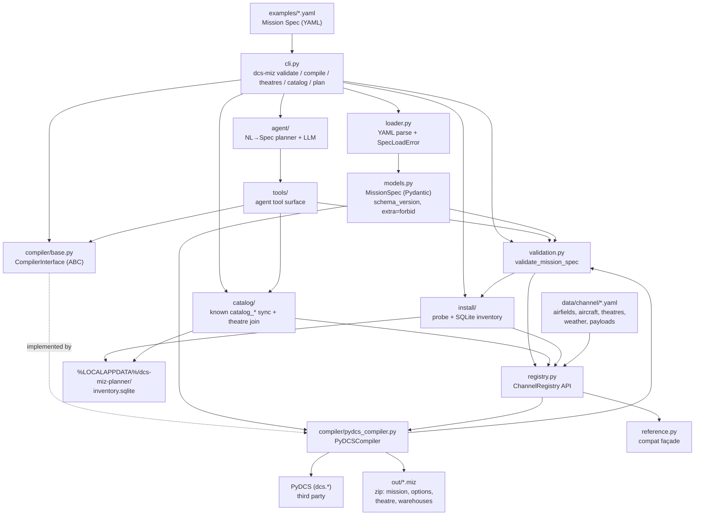

# Architecture

Developer map of the code. For *why* the project exists, see
[`DCS_AI_Mission_Planner.md`](../DCS_AI_Mission_Planner.md); for sequencing, see
[`BACKLOG.md`](BACKLOG.md).

**One rule shapes every box below:** the planning side decides *what* mission to build,
deterministic code decides *how* it becomes a `.miz`. No LLM writes DCS Lua.

## Compile path



ASCII fallback:

```text
YAML spec -> cli -> loader -> MissionSpec -> validate_mission_spec
                                                  |     ^
                                                  |     | (same engine)
                                                  v     |
                                          PyDCSCompiler <- registry + install inventory
                                                  |  (PyDCS)
                                                  v
                                               .miz

cli validate  -> validation.py
cli theatres  -> install/ (probe) -> inventory.sqlite  (refresh on demand)
cli catalog   -> catalog/ (sync known from YAML+enums; list joins install theatres)
cli plan      -> agent/ (NL→Spec; tools + stub/live LLM; validate gate)
tools.*       -> catalog lookups + validation + PyDCSCompiler (agent API)
```

## Modules

| Module | Responsibility | Depends on |
|--------|----------------|------------|
| `cli.py` | `validate` / `compile` / `theatres` / `catalog` / `plan`; legacy spec path | `loader`, `validation`, `compiler`, `install`, `catalog`, `agent` |
| `loader.py` | YAML → `MissionSpec`; raises `SpecLoadError` with readable messages | `models`, `pyyaml` |
| `models.py` | The public contract: `MissionSpec` + enums. Free flight + intercept; reserves `triggers` | `pydantic` |
| `validation.py` | Shared Spec checks (registry DCS-exists + install theatre availability + type rules); multi-error result | `models`, `registry`, `install` |
| `data/channel/` | Committed Channel YAML tables (airdromeIds, aircraft+radio, theatres, weather presets, payload stub) | — |
| `registry.py` | Loads packaged YAML; lookup API shared by validator/compiler (later agent) | `data/channel`, `pyyaml` |
| `reference.py` | Thin compatibility façade over `registry` (legacy constant names) | `registry` |
| `catalog/` | Known `catalog_*` SQLite synced from YAML + Spec enums; theatre views join install inventory (`known` / `offerable`) | `registry`, `install`, stdlib `sqlite3` |
| `tools/` | Agent-facing callables: `find_airfield`, `get_aircraft_details`, `list_mission_options`, `validate_mission_spec`, `compile_mission` | `catalog`, `validation`, `compiler`, `loader` |
| `agent/` | NL→Spec planner: tool loop, stub LLM, OpenAI-compatible live client (`OPENAI_API_KEY`) | `tools`, `validation`, `compiler`, `openai` |
| `install/` | Read-only DCS install probe; classify available/disabled/incomplete/unknown; SQLite cache | `registry`, stdlib `sqlite3` |
| `compiler/base.py` | `CompilerInterface` — the seam that keeps PyDCS swappable | `models` |
| `compiler/pydcs_compiler.py` | **Only** module allowed to import PyDCS. Validates via shared engine, places player (and intercept enemies), writes `.miz` | `models`, `validation`, `registry`, `dcs.*` |

Three stores stay separate on purpose:

- **YAML registry** = product source of truth (what this planner knows how to compile).
- **SQLite install inventory** = user-local cache of what is installed/enabled on this PC
  (`theatres` / `scan_meta` tables in `%LOCALAPPDATA%\dcs-miz-planner\inventory.sqlite`).
- **SQLite known catalog** = agent/UI query layer (`catalog_*` tables in the **same** DB file),
  replaced by `dcs-miz catalog sync` from packaged YAML + Spec enums — not a second DCS-id SoT.

Ordinary install reads hit the DB; `dcs-miz theatres --refresh` rescans. Never commit the DB.

**Promote-to-known (ad-hoc):** edit `data/channel/*.yaml` (and Spec enums when needed) →
accept compile in DCS when that asset is compile-supported → run `dcs-miz catalog sync`.
Do not auto-promote discovered install theatres/modules into known YAML.

Two boundaries worth respecting:

- **`models.py` never imports compiler or PyDCS types.** The Spec is the contract; it must
  stay serializable and backend-agnostic.
- **PyDCS imports live inside `pydcs_compiler.py` function bodies**, so importing the package
  never eagerly loads a DCS install. That module also carries deliberate workarounds
  (payload-scan disable, `theatre` member, VHF frequency) — see
  [`LESSONS_LEARNED.md`](LESSONS_LEARNED.md) before editing it.
- **Install probe never executes DCS Lua**; it only extracts static quoted fields from
  `entry.lua` / `pluginsEnabled.lua`.

## Repo layout

| Path | What lives there |
|------|------------------|
| `src/dcs_miz_planner/` | Product code (the modules above) |
| `examples/` | Checked-in Mission Specs; `manston_cold_freeflight.yaml` + `manston_dawn_intercept.yaml` |
| `tests/` | pytest: schema, registry, install, catalog, tools, agent, validation, goldens |
| `openspec/` | Spec-driven workflow: `specs/` (current truth), `changes/` (in flight), `changes/archive/` |
| `.cursor/` | Agent tooling: `skills/`, `hooks/`, `rules/`, `commands/` |
| `docs/` | This file, `BACKLOG.md`, `LESSONS_LEARNED.md` |
| `out/` | Generated `.miz` output (gitignored) |
| `research/` | Local DCS samples and findings — **gitignored**, never a source of truth for specs |

Planning and product are deliberately separate: `openspec/specs/` states what the system
must do, `src/` implements it, and no code lands before its change is apply-ready.

## Keeping this current

Update this file when the public package layout changes, a module gains or loses a
responsibility, or the Spec→`.miz` flow shifts — same commit as the change, not later.
A Cursor hook (`.cursor/hooks/architecture-on-push.py`) reminds you on `git push` when
`src/dcs_miz_planner/` is part of what you are pushing. It only reminds; it never blocks,
and it is not a generator — the map is written by hand so it explains intent, not just imports.

Not yet built (later M3): prefs/history, squadron voice. Aircraft module discovery
from install is deferred (`catalog-discover-modules`).
