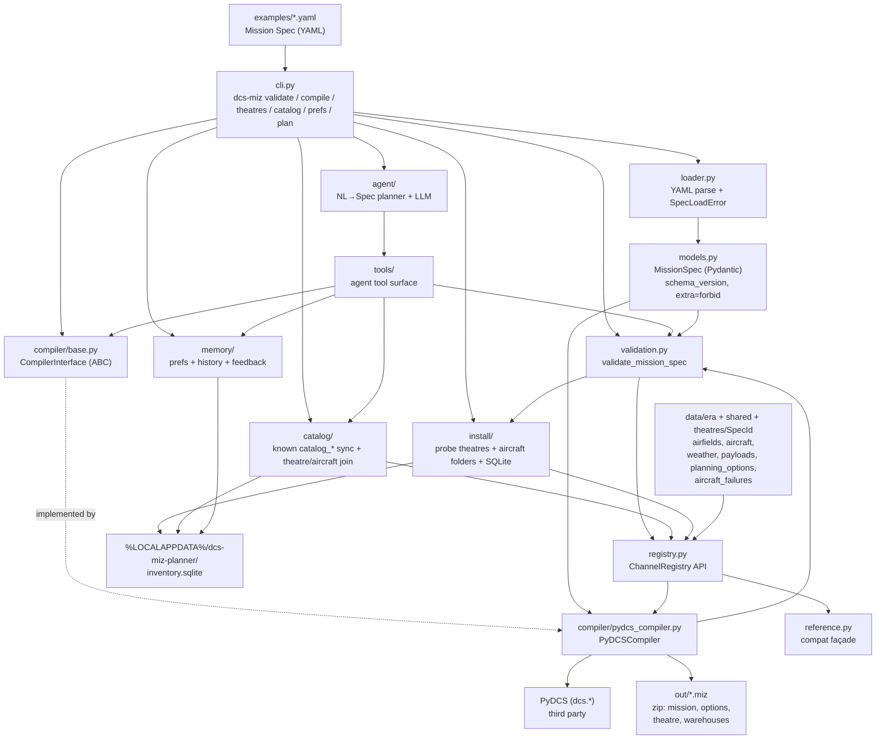
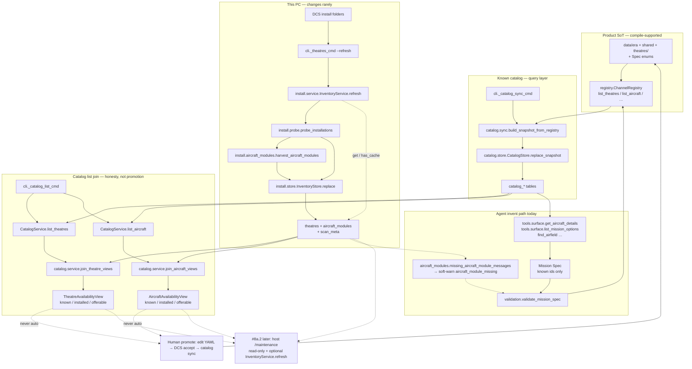

# Architecture

Developer map of the code. For *why* the project exists, see
[`DCS_AI_Mission_Planner.md`](../DCS_AI_Mission_Planner.md); for sequencing, see
[`BACKLOG.md`](BACKLOG.md).

**One rule shapes every box below:** the planning side decides *what* mission to build,
deterministic code decides *how* it becomes a `.miz`. No LLM writes DCS Lua.

## Compile path



ASCII fallback:

```text
YAML spec -> cli -> loader -> MissionSpec -> narrative expand (if enabled)
                                                  |
                                                  v
                                          dynamics expand (if set; XOR narrative)
                                                  |
                                                  v
                                          validate_mission_spec
                                                  |     ^
                                                  |     | (same engine)
                                                  v     |
                                          PyDCSCompiler <- registry + install inventory
                                                  |  (PyDCS)
                                                  v
                                               .miz

cli validate  -> validation.py
cli theatres  -> install/ (probe) -> inventory.sqlite  (refresh on demand;
                 theatres + aircraft_modules)
cli catalog   -> catalog/ (sync known from YAML+enums; list joins install
                 theatres and aircraft)
cli prefs / feedback -> memory/ (user_* tables in same SQLite)
cli plan      -> agent/ (NL→Spec one-shot; voice + tools + stub/live LLM; validate gate; commander brief; records history)
cli chat      -> agent/session (multi-turn REPL; slash cmds; /accept writes Spec)
tools.*       -> catalog + memory + research + validation + PyDCSCompiler (agent API;
                 planning tools still use *known* aircraft/theatres, not discovered-only)
```

## Modules

| Module | Responsibility | Depends on |
|--------|----------------|------------|
| `cli.py` | `validate` / `compile` / `theatres` / `catalog` / `prefs` / `feedback` / `plan`; legacy spec path | `loader`, `validation`, `compiler`, `install`, `catalog`, `memory`, `agent` |
| `loader.py` | YAML → `MissionSpec`; raises `SpecLoadError` with readable messages | `models`, `pyyaml` |
| `models.py` | The public contract: `MissionSpec` + enums. Free flight through recon; optional `player.flight` (2–4 ship lead/wingman); weather trio; typed `zones`/`triggers` (no Lua; native emit incl. sound, numeric flags, `group_life_less`, `mark`/`smoke`, player altitude/speed gates); optional `narrative.enabled`; optional `dynamics` (play-time pools) | `pydantic` |
| `recon.py` | Recon AOI find pack → inject zone + mark/find message triggers before compile | `models` |
| `target_motion.py` | Optional GA/recon target patrol/path → native ship/vehicle waypoints + SwitchWaypoint loop; calls target AI emit | `models`, `target_ai` |
| `target_ai.py` | Curated target WP Opt* / PointAction (#15h); class allowlists soft/AAA/sea | `models` |
| `narrative.py` | Opt-in CAP/intercept/escort/GA pack → materialise zones/triggers (squadron-voice message text); runs before validate/compile | `models`, `agent.voice` |
| `dynamics.py` | Opt-in play-time Layer B pack (`fixed`/`live`/`choose`/`hybrid` + pools) → typed triggers; XOR with narrative; runs after narrative expand | `models` |
| `validation.py` | Shared Spec checks (registry DCS-exists + install theatre availability + type rules + sound `asset_id` + group life indices/percent); multi-error result | `models`, `registry`, `sounds`, `install` |
| `channel_domain.py` | Land/sea probe (UK–FR chord) for TheChannel only; fail-closed `domain_unsupported_theatre` otherwise; `airfield_relative_map_point` passes `theatre=` | `models`, `registry`, `theatre_terrain` |
| `intercept_spawn.py` | Theatre-keyed intercept enemy spawn recipes (TheChannel Hawkinge/Dover literals only) | none |
| `allowlists.py` | Known skills + country hint; countries from era YAML via registry | `registry` |
| `data/era/`, `data/shared/`, `data/theatres/<SpecId>/` | Packaged YAML SoT (era WWII units/countries, shared weather/planning, per-theatre airfields) | shipped in wheel via hatch force-include |
| `data/qag_fixtures/` | Thin YAML index of gitignored `research/` QAG HTML for `research_guidance` (pages stay local; not catalog SoT) | shipped in wheel via hatch force-include |
| `data/sounds/` | Curated sound assets (`asset_id` → `.wav`/`.ogg`) for Spec `sound` actions | shipped in wheel via hatch force-include |
| `registry.py` | Loads packaged YAML (era + shared + theatre walker); `era_for_theatre` / `list_countries`; lookup API shared by validator/compiler | `data/era`, `data/shared`, `data/theatres`, `pyyaml` |
| `sounds.py` | Sound-asset registry lookup + path materialization for `.miz` embed | `data/sounds`, `pyyaml` |
| `reference.py` | Thin compatibility façade over `registry` (legacy constant names) | `registry` |
| `catalog/` | Known `catalog_*` SQLite synced from YAML + Spec enums + planning options + strike units (`era_id` + Channel `theatre_id`); joins install inventory for theatres **and** aircraft modules (`known` / `installed` / `offerable`; discovered-only never promoted) | `registry`, `install`, stdlib `sqlite3` |
| `memory/` | User prefs, generation history, satisfaction feedback (`user_*` tables; never wiped by catalog sync) | `install.default_db_path`, stdlib `sqlite3` |
| `tools/` | Agent-facing callables: catalog lookups (`list_strike_targets`, …), `get_mission_spec_schema`, validate/compile, `randomize_mission`, prefs/history/feedback, research_guidance (`focus=mission_design`), `list_installed_campaigns` | `catalog`, `memory`, `validation`, `compiler`, `loader`, `randomize`, `install.campaigns`, `agent/spec_schema` |
| `briefing.py` | Spec → plain-text Sortie / Description / Blue|Red Task for `.miz` `l10n` (splits commander brief; lazy-imports voice) | `models`, `agent.voice` |
| `weather_invent.py` | Seeded invent snapshot from Spec weather pattern + date/time | `models`, `registry` |
| `weather_apply.py` | Apply invent snapshot to PyDCS `Mission.weather` | `weather_invent`, `weather_gallery`, `dcs.weather` |
| `weather_gallery.py` | Packaged gallery decode + `CloudPreset` resolve (incl. ME-only rainy light ids) | `data/shared/weather_gallery.yaml` |
| `weather_metar.py` | Offline synthetic METAR from invent snapshot (`EGMH` TheChannel-only + `RMK SIM`) | `weather_invent`, `weather_gallery` |
| `weather_sot.py` | Enum / YAML / planning / compiler weather-id parity sets | `models`, `registry` |
| `randomize.py` | Seeded Spec→Spec variation (weather/time/geometry/opposition); compiler stays deterministic | `models`, `registry` |
| `agent/` | NL→Spec planner + interactive `chat` REPL: tool loop, derived Spec shape (`spec_schema`), squadron voice, commander brief, slash cmds (`/accept`, `/briefing`, `/research`, `/catalog`, …), stub/live LLM; host-records generation history | `tools`, `memory`, `validation`, `compiler`, `openai` |
| `install/` | Read-only DCS install probe; theatre + aircraft-module inventory (folder harvest); `campaigns` index; SQLite cache on `--refresh` | `registry`, stdlib `sqlite3` |
| `compiler/base.py` | `CompilerInterface` — the seam that keeps PyDCS swappable | `models` |
| `compiler/pydcs_compiler.py` | **Only** module allowed to import PyDCS. Expands narrative/dynamics/recon-find if needed, validates via shared engine, places player (intercept enemies / CAP orbit+ROE / ground-attack loadout+strike+enemy vehicles / escort package+EscortTaskAction+optional bounce / recon Reconnaissance+AOI contacts), emits native zones/triggers + optional fog_dynamics + optional aircraft failures, writes briefing `l10n` + `.miz` | `models`, `narrative`, `recon`, `dynamics`, `validation`, `registry`, `briefing`, `compiler.triggers_emit`, `compiler.fog_emit`, `compiler.failures_emit`, `dcs.*` |
| `compiler/triggers_emit.py` | Spec zones/triggers → PyDCS `add_triggerzone` + `TriggerOnce`/`Continious` rules (incl. `SoundToAll`, numeric flags, `GroupLifeLess`, `MarkToAll`, `ExplodeWPMarker`, player `UnitAltitude*` / `UnitSpeed*`) | `models`, `sounds`, `dcs.condition`/`action`/`triggers` |
| `compiler/fog_emit.py` | Spec `fog_dynamics` → ONCE `TimeAfter` + `DoScriptFile` (`fog_dynamics.lua` resource; curated `setFogAnimation`) | `fog_dynamics`, `models`, `dcs.*` |
| `compiler/failures_emit.py` | Spec `failures` → mission-root Failures table (`enable`/`hh`/`mm`/`mmint`/`prob`; Within minutes, min 1) | `models` |
| `compiler/section_orders_emit.py` | Spec `player.flight.orders` → F10 Section:… + flag→`AITaskPush` / `GroupStop` | `models`, `dcs.*` |
| `compiler/discipline_emit.py` | Spec `player.flight.discipline` → moving zone + soft/hard fail-to-follow | `models`, `dcs.*` |

Four table namespaces share one DB file on purpose:

- **YAML registry** = product source of truth (what this planner knows how to compile).
- **SQLite install inventory** = user-local cache of what is on this PC
  (`theatres`, `aircraft_modules`, `scan_meta` in
  `%LOCALAPPDATA%\dcs-miz-planner\inventory.sqlite`). Filled by
  `dcs-miz theatres --refresh` (rare; installs seldom change).
- **SQLite known catalog** = agent/UI query layer (`catalog_*` in the **same** DB),
  replaced by `dcs-miz catalog sync` from packaged YAML + Spec enums + planning-option
  rows — not a second DCS-id SoT. Planning options carry `supported` / `advisory` /
  `future`. Extra DCS maps (e.g. Normandy) are not required for this catalog.
- **SQLite user memory** = prefs + generation history + feedback (`user_*`); catalog
  sync must not clear these.

### Known vs discovered (catalog layers)



| Concern | Primary callables |
|---------|-------------------|
| Known SoT | `registry.ChannelRegistry`, packaged `data/era/` + `data/shared/` + `data/theatres/<SpecId>/` |
| Sync known → SQLite | `cli._catalog_sync_cmd` → `catalog.sync.build_snapshot_from_registry` → `CatalogStore.replace_snapshot` |
| Rescan install | `cli._theatres_cmd` (`--refresh`) → `InventoryService.refresh` → `probe.probe_installations` + `aircraft_modules.harvest_aircraft_modules` → `InventoryStore.replace` |
| Read cache | `InventoryService.get` / `has_cache`; `CatalogService.ensure_synced` |
| Join list | `CatalogService.list_theatres` / `list_aircraft` → `join_theatre_views` / `join_aircraft_views` → `TheatreAvailabilityView` / `AircraftAvailabilityView` |
| Agent lookups | `tools.surface.get_aircraft_details`, `list_mission_options` (optional `theatre=` filters `channel_place` by `meta.theatre`), `list_strike_targets`, `find_airfield` (known catalog; not discovered-only) |
| Missing known pack | `aircraft_modules.missing_aircraft_module_messages` (validate soft-warn) |
| Chat host summary | `agent.session.PlanSession._catalog` → `list_mission_options` (offerable theatres + known aircraft ids) |

| Flag | Meaning |
|------|---------|
| **known** | Present in packaged YAML / `catalog_*` after sync — planner may use as Spec id (subject to other rules). |
| **installed** | Present in last inventory scan (theatre available/disabled/… or aircraft folder on disk). |
| **offerable** | Known **and** locally usable for planning (theatre: available + planner-supported; aircraft: known + folder present). |
| **discovered-only** | On disk (or in inventory) but **not** in known YAML — list for honesty; never emit as Spec theatre/aircraft. |

Ordinary install reads hit the DB; `dcs-miz theatres --refresh` rescans. Never commit the DB.

**Promote-to-known (ad-hoc):** edit packaged YAML under `data/era/`, `data/shared/`,
`data/theatres/<SpecId>/` (and Spec enums when needed) →
accept compile in DCS when that asset is compile-supported → run `dcs-miz catalog sync`.
Do not auto-promote discovered install theatres/modules into known YAML.

Two boundaries worth respecting:

- **`models.py` never imports compiler or PyDCS types.** The Spec is the contract; it must
  stay serializable and backend-agnostic.
- **PyDCS imports live inside `pydcs_compiler.py` function bodies**, so importing the package
  never eagerly loads a DCS install. That module also carries deliberate workarounds
  (payload-scan disable, `theatre` member, VHF frequency) — see
  [`LESSONS_LEARNED.md`](LESSONS_LEARNED.md) before editing it.
- **Install probe never executes DCS Lua**; it only extracts static quoted fields from
  `entry.lua` / `pluginsEnabled.lua`.

## Repo layout

| Path | What lives there |
|------|------------------|
| `src/dcs_miz_planner/` | Product code (the modules above) |
| `examples/` | Checked-in Mission Specs; free-flight, intercept, CAP, ground-attack, escort, recon, and mid-Channel U-boat recon/hunt Manston examples |
| `tests/` | pytest: schema, registry, install, catalog, memory, tools, agent, validation, goldens |
| `openspec/` | Spec-driven workflow: `specs/` (current truth), `changes/` (in flight), `changes/archive/` |
| `.cursor/` | Agent tooling: `skills/`, `hooks/`, `rules/`, `commands/` |
| `docs/` | This file, `BACKLOG.md`, `LESSONS_LEARNED.md`, `THEATRE_TARGET_PROMOTE.md` |
| `out/` | Generated `.miz` output (gitignored) |
| `research/` | Local DCS samples and findings — **gitignored**, never a source of truth for specs |

Planning and product are deliberately separate: `openspec/specs/` states what the system
must do, `src/` implements it, and no code lands before its change is apply-ready.

## Keeping this current

Update this file when the public package layout changes, a module gains or loses a
responsibility, or the Spec→`.miz` flow shifts — same commit as the change, not later.
A Cursor hook (`.cursor/hooks/architecture-on-push.py`) reminds you on `git push` when
`src/dcs_miz_planner/` is part of what you are pushing. It only reminds; it never blocks,
and it is not a generator — the map is written by hand so it explains intent, not just imports.

Not yet built (parked): host `/maintenance` install summary (`#8a.2`); see
[`BACKLOG.md`](BACKLOG.md).
