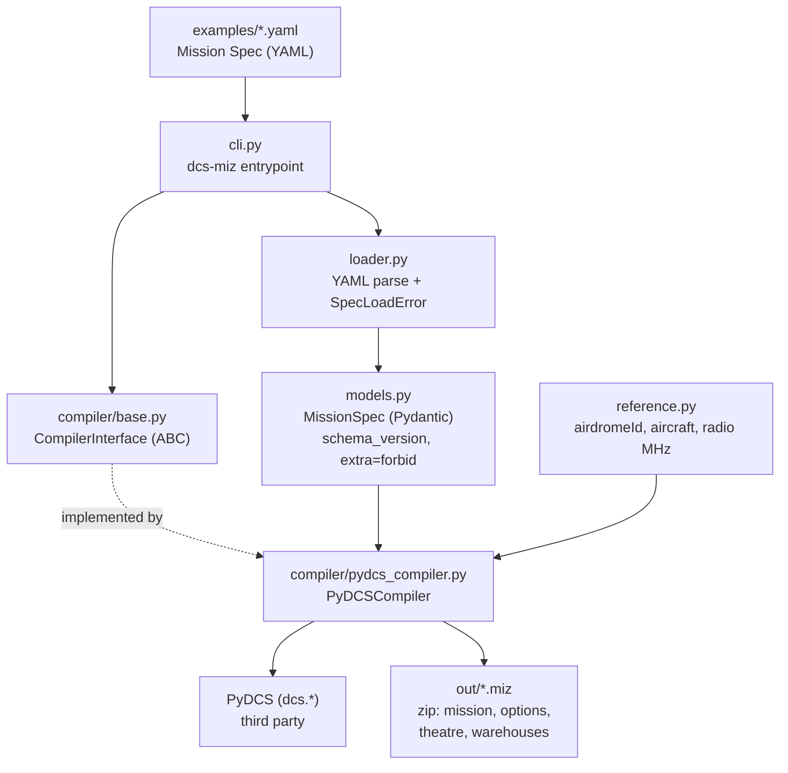

# Architecture

Developer map of the code. For *why* the project exists, see
[`DCS_AI_Mission_Planner.md`](../DCS_AI_Mission_Planner.md); for sequencing, see
[`BACKLOG.md`](BACKLOG.md).

**One rule shapes every box below:** the planning side decides *what* mission to build,
deterministic code decides *how* it becomes a `.miz`. No LLM writes DCS Lua.

## Compile path



ASCII fallback:

```text
YAML spec -> cli -> loader -> MissionSpec -> CompilerInterface
                                                  |
                                          PyDCSCompiler <- reference.py
                                                  |  (PyDCS)
                                                  v
                                               .miz
```

## Modules

| Module | Responsibility | Depends on |
|--------|----------------|------------|
| `cli.py` | Parse args, load spec, call compiler, report clean errors (exit `2` on bad spec) | `loader`, `compiler` |
| `loader.py` | YAML → `MissionSpec`; raises `SpecLoadError` with readable messages | `models`, `pyyaml` |
| `models.py` | The public contract: `MissionSpec` + enums. Rejects unknown fields; reserves `enemies`/`objectives`/`triggers` | `pydantic` |
| `reference.py` | Verified DCS facts: Channel `airdromeId`, known aircraft, radio MHz, supported theatres | — |
| `compiler/base.py` | `CompilerInterface` — the seam that keeps PyDCS swappable | `models` |
| `compiler/pydcs_compiler.py` | **Only** module allowed to import PyDCS. Places the flight, applies time/weather/radio, writes the `.miz` | `models`, `reference`, `dcs.*` |

Two boundaries worth respecting:

- **`models.py` never imports compiler or PyDCS types.** The Spec is the contract; it must
  stay serializable and backend-agnostic.
- **PyDCS imports live inside `pydcs_compiler.py` function bodies**, so importing the package
  never eagerly loads a DCS install. That module also carries deliberate workarounds
  (payload-scan disable, `theatre` member, VHF frequency) — see
  [`LESSONS_LEARNED.md`](LESSONS_LEARNED.md) before editing it.

## Repo layout

| Path | What lives there |
|------|------------------|
| `src/dcs_miz_planner/` | Product code (the modules above) |
| `examples/` | Checked-in Mission Specs; `manston_cold_freeflight.yaml` is the acceptance fixture |
| `tests/` | pytest: schema contract tests + end-to-end compile asserts |
| `openspec/` | Spec-driven workflow: `specs/` (current truth), `changes/` (in flight), `changes/archive/` |
| `.cursor/` | Agent tooling: `skills/`, `hooks/`, `rules/`, `commands/` |
| `docs/` | This file, `BACKLOG.md`, `LESSONS_LEARNED.md` |
| `out/` | Generated `.miz` output (gitignored) |
| `research/` | Local DCS samples and findings — **gitignored**, never a source of truth for specs |

Planning and product are deliberately separate: `openspec/specs/` states what the system
must do, `src/` implements it, and no code lands before its change is apply-ready.

## Keeping this current

Update this file when the public package layout changes, a module gains or loses a
responsibility, or the Spec→`.miz` flow shifts — same commit as the change, not later.
A Cursor hook (`.cursor/hooks/architecture-on-push.py`) reminds you on `git push` when
`src/dcs_miz_planner/` is part of what you are pushing. It only reminds; it never blocks,
and it is not a generator — the map is written by hand so it explains intent, not just imports.

Not yet built (arrives with M3 in the backlog): the agent layer that turns natural language
into a Mission Spec, plus registry-backed lookup tools.
