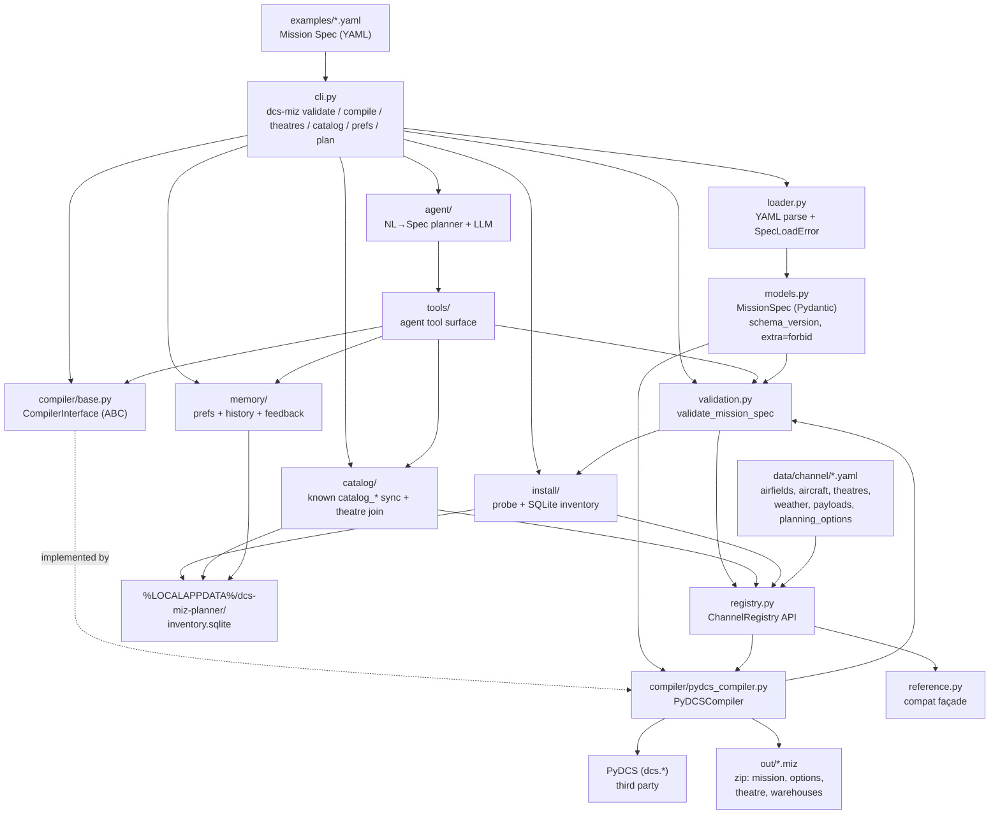

# Architecture

Developer map of the code. For *why* the project exists, see
[`DCS_AI_Mission_Planner.md`](../DCS_AI_Mission_Planner.md); for sequencing, see
[`BACKLOG.md`](BACKLOG.md).

**One rule shapes every box below:** the planning side decides *what* mission to build,
deterministic code decides *how* it becomes a `.miz`. No LLM writes DCS Lua.

## Compile path



ASCII fallback:

```text
YAML spec -> cli -> loader -> MissionSpec -> narrative expand (if enabled)
                                                  |
                                                  v
                                          validate_mission_spec
                                                  |     ^
                                                  |     | (same engine)
                                                  v     |
                                          PyDCSCompiler <- registry + install inventory
                                                  |  (PyDCS)
                                                  v
                                               .miz

cli validate  -> validation.py
cli theatres  -> install/ (probe) -> inventory.sqlite  (refresh on demand)
cli catalog   -> catalog/ (sync known from YAML+enums; list joins install theatres)
cli prefs / feedback -> memory/ (user_* tables in same SQLite)
cli plan      -> agent/ (NL→Spec one-shot; voice + tools + stub/live LLM; validate gate; commander brief; records history)
cli chat      -> agent/session (multi-turn REPL; slash cmds; /accept writes Spec)
tools.*       -> catalog + memory + research + validation + PyDCSCompiler (agent API)
```

## Modules

| Module | Responsibility | Depends on |
|--------|----------------|------------|
| `cli.py` | `validate` / `compile` / `theatres` / `catalog` / `prefs` / `feedback` / `plan`; legacy spec path | `loader`, `validation`, `compiler`, `install`, `catalog`, `memory`, `agent` |
| `loader.py` | YAML → `MissionSpec`; raises `SpecLoadError` with readable messages | `models`, `pyyaml` |
| `models.py` | The public contract: `MissionSpec` + enums. Free flight through escort; weather trio; typed `zones`/`triggers` (no Lua; native emit incl. sound, numeric flags, `group_life_less`, `mark`/`smoke`, player altitude/speed gates); optional `narrative.enabled` | `pydantic` |
| `narrative.py` | Opt-in CAP pack → materialise zones/triggers (squadron-voice message text); runs before validate/compile | `models`, `agent.voice` |
| `validation.py` | Shared Spec checks (registry DCS-exists + install theatre availability + type rules + sound `asset_id` + group life indices/percent); multi-error result | `models`, `registry`, `sounds`, `install` |
| `data/channel/` | Committed Channel YAML SoT (airdromeIds, aircraft+radio, theatres, weather, payloads, planning_options) | shipped in wheel via hatch force-include |
| `data/sounds/` | Curated sound assets (`asset_id` → `.wav`/`.ogg`) for Spec `sound` actions | shipped in wheel via hatch force-include |
| `registry.py` | Loads packaged YAML; lookup API shared by validator/compiler (later agent) | `data/channel`, `pyyaml` |
| `sounds.py` | Sound-asset registry lookup + path materialization for `.miz` embed | `data/sounds`, `pyyaml` |
| `reference.py` | Thin compatibility façade over `registry` (legacy constant names) | `registry` |
| `catalog/` | Known `catalog_*` SQLite synced from YAML + Spec enums + planning options; theatre views join install inventory (`known` / `offerable`) | `registry`, `install`, stdlib `sqlite3` |
| `memory/` | User prefs, generation history, satisfaction feedback (`user_*` tables; never wiped by catalog sync) | `install.default_db_path`, stdlib `sqlite3` |
| `tools/` | Agent-facing callables: catalog lookups, `get_mission_spec_schema`, validate/compile, `randomize_mission`, prefs/history/feedback, research_guidance | `catalog`, `memory`, `validation`, `compiler`, `loader`, `randomize`, `agent/spec_schema` |
| `briefing.py` | Spec → plain-text Sortie / Description / Blue|Red Task for `.miz` `l10n` (splits commander brief; lazy-imports voice) | `models`, `agent.voice` |
| `randomize.py` | Seeded Spec→Spec variation (weather/time/geometry/opposition); compiler stays deterministic | `models`, `registry` |
| `agent/` | NL→Spec planner + interactive `chat` REPL: tool loop, derived Spec shape (`spec_schema`), squadron voice, commander brief, slash cmds (`/accept`, `/briefing`, `/research`, `/catalog`, …), stub/live LLM; host-records generation history | `tools`, `memory`, `validation`, `compiler`, `openai` |
| `install/` | Read-only DCS install probe; classify available/disabled/incomplete/unknown; SQLite cache | `registry`, stdlib `sqlite3` |
| `compiler/base.py` | `CompilerInterface` — the seam that keeps PyDCS swappable | `models` |
| `compiler/pydcs_compiler.py` | **Only** module allowed to import PyDCS. Expands narrative if needed, validates via shared engine, places player (intercept enemies / CAP orbit+ROE / ground-attack loadout+strike+enemy vehicles / escort package+EscortTaskAction+optional bounce), emits native zones/triggers, writes briefing `l10n` + `.miz` | `models`, `narrative`, `validation`, `registry`, `briefing`, `compiler.triggers_emit`, `dcs.*` |
| `compiler/triggers_emit.py` | Spec zones/triggers → PyDCS `add_triggerzone` + `TriggerOnce`/`Continious` rules (incl. `SoundToAll`, numeric flags, `GroupLifeLess`, `MarkToAll`, `ExplodeWPMarker`, player `UnitAltitude*` / `UnitSpeed*`) | `models`, `sounds`, `dcs.condition`/`action`/`triggers` |

Three stores stay separate on purpose (four table namespaces, one DB file):

- **YAML registry** = product source of truth (what this planner knows how to compile).
- **SQLite install inventory** = user-local cache of what is installed/enabled on this PC
  (`theatres` / `scan_meta` tables in `%LOCALAPPDATA%\dcs-miz-planner\inventory.sqlite`).
- **SQLite known catalog** = agent/UI query layer (`catalog_*` tables in the **same** DB file),
  replaced by `dcs-miz catalog sync` from packaged YAML + Spec enums + planning-option rows —
  not a second DCS-id SoT. Planning options carry `supported` / `advisory` / `future` so the
  agent can invent situations without claiming unsupported knobs compile. Extra DCS maps
  (e.g. Normandy) are not required for this catalog.
- **SQLite user memory** = prefs + generation history + feedback (`user_meta` / `user_prefs` /
  `generation_history` / `satisfaction_feedback`); catalog sync must not clear these.

Ordinary install reads hit the DB; `dcs-miz theatres --refresh` rescans. Never commit the DB.

**Promote-to-known (ad-hoc):** edit `data/channel/*.yaml` (and Spec enums when needed) →
accept compile in DCS when that asset is compile-supported → run `dcs-miz catalog sync`.
Do not auto-promote discovered install theatres/modules into known YAML.

Two boundaries worth respecting:

- **`models.py` never imports compiler or PyDCS types.** The Spec is the contract; it must
  stay serializable and backend-agnostic.
- **PyDCS imports live inside `pydcs_compiler.py` function bodies**, so importing the package
  never eagerly loads a DCS install. That module also carries deliberate workarounds
  (payload-scan disable, `theatre` member, VHF frequency) — see
  [`LESSONS_LEARNED.md`](LESSONS_LEARNED.md) before editing it.
- **Install probe never executes DCS Lua**; it only extracts static quoted fields from
  `entry.lua` / `pluginsEnabled.lua`.

## Repo layout

| Path | What lives there |
|------|------------------|
| `src/dcs_miz_planner/` | Product code (the modules above) |
| `examples/` | Checked-in Mission Specs; free-flight, intercept, CAP, ground-attack, and escort Manston examples |
| `tests/` | pytest: schema, registry, install, catalog, memory, tools, agent, validation, goldens |
| `openspec/` | Spec-driven workflow: `specs/` (current truth), `changes/` (in flight), `changes/archive/` |
| `.cursor/` | Agent tooling: `skills/`, `hooks/`, `rules/`, `commands/` |
| `docs/` | This file, `BACKLOG.md`, `LESSONS_LEARNED.md` |
| `out/` | Generated `.miz` output (gitignored) |
| `research/` | Local DCS samples and findings — **gitignored**, never a source of truth for specs |

Planning and product are deliberately separate: `openspec/specs/` states what the system
must do, `src/` implements it, and no code lands before its change is apply-ready.

## Keeping this current

Update this file when the public package layout changes, a module gains or loses a
responsibility, or the Spec→`.miz` flow shifts — same commit as the change, not later.
A Cursor hook (`.cursor/hooks/architecture-on-push.py`) reminds you on `git push` when
`src/dcs_miz_planner/` is part of what you are pushing. It only reminds; it never blocks,
and it is not a generator — the map is written by hand so it explains intent, not just imports.

Not yet built (later M3/M4): aircraft module discovery from install is
deferred (`catalog-discover-modules`).
